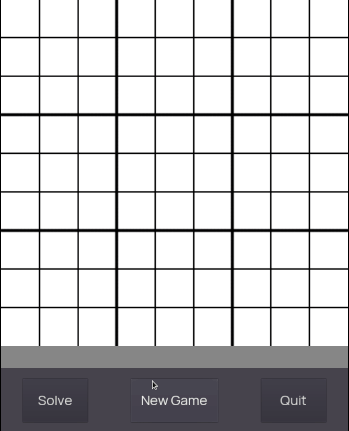
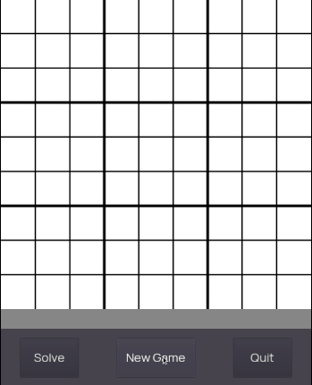

# Sudoku

A Sudoku game created using Godot Game Engine

## Game modes

### Solver mode

Draw your incomplete sudoku puzzle and let the computer solve it for you!

### Normal mode

Play a normal game of Sudoku with different difficulties: easy, medium and hard.

## How it works

This project is the adaptation of my previous [Sudoku solver](https://github.com/davidlunadeleon/sudoku-solver) made with C++. The Sudoku problem is modelled as a CSP and simplified using the AC-3 Algorithm to ensure arc consistency between variables. This helps simplify the problem by reducing the domain of each variable.

To generate new Sudokus, the same code is reused. A random number between 1 and 9 is chosen and placed in all columns of the grid making sure no constraints are ignored. After the number is placed in its place, the Sudoku is solved to generate a complete puzzle. Afterwards, a random number of cells in the grid are cleared to let the user fill in the gaps. The number of deleted cells varies depending on difficulty.

## Built with

- [Godot Game Engine](https://godotengine.org/)
- [Manrope Font](https://manropefont.com/)
